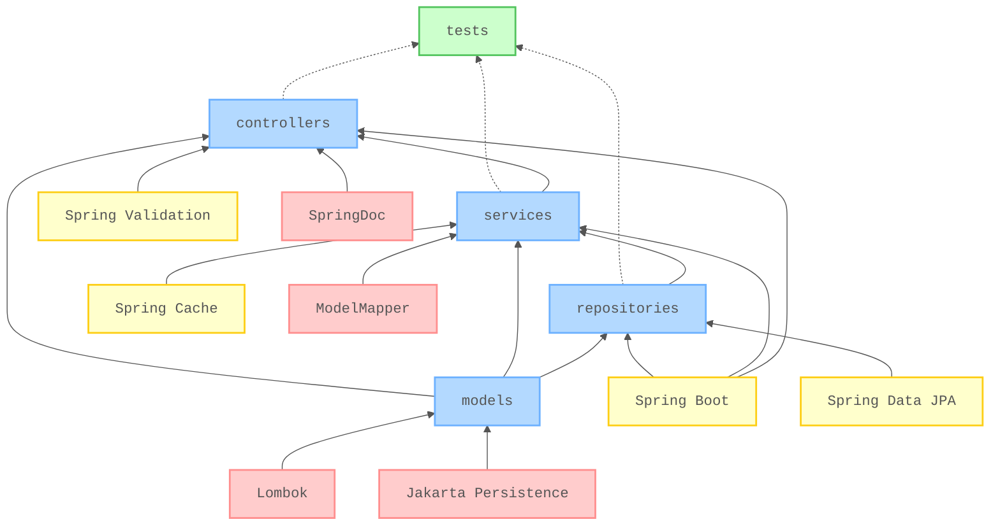

# 🧪 RESTful API with Java and Spring Boot

[](https://github.com/nanotaboada/java.samples.spring.boot/actions/workflows/maven.yml)
[](https://sonarcloud.io/summary/new_code?id=nanotaboada_java.samples.spring.boot)
[](https://codecov.io/gh/nanotaboada/java.samples.spring.boot)
[](https://www.codefactor.io/repository/github/nanotaboada/java.samples.spring.boot)
[](https://opensource.org/licenses/MIT)

Proof of Concept for a RESTful Web Service built with **Spring Boot 4** targeting **JDK 25 (LTS)**. This project demonstrates best practices for building a layered, testable, and maintainable API implementing CRUD operations for a Players resource (Argentina 2022 FIFA World Cup squad).

## Table of Contents

- [Features](#features)
- [Tech Stack](#tech-stack)
- [Project Structure](#project-structure)
- [Architecture](#architecture)
- [API Endpoints](#api-endpoints)
- [Prerequisites](#prerequisites)
- [Quick Start](#quick-start)
  - [Clone](#clone)
  - [Build](#build)
  - [Run](#run)
  - [Access](#access)
- [Testing](#testing)
- [Docker](#docker)
  - [Build and Start](#build-and-start)
  - [Stop](#stop)
  - [Reset Database](#reset-database)
- [Environment Variables](#environment-variables)
- [Command Summary](#command-summary)
- [Contributing](#contributing)
- [Legal](#legal)

## Features

- 🔌 **RESTful API** - Full CRUD operations for Players resource
- 📚 **Clean Architecture** - Layered design with clear separation of concerns
- 🚦 **Input Validation** - Bean Validation (JSR-380) constraints
- ⚡ **Performance Caching** - Optimized data retrieval with cache annotations
- 🔍 **Advanced Search** - League search with JPQL and squad number lookup with derived queries
- 📝 **Interactive Documentation** - Live API exploration and testing interface
- 🩺 **Health Monitoring** - Application health and metrics endpoints
- ✅ **Comprehensive Testing** - High code coverage with automated reporting
- 🐳 **Containerized Deployment** - Multi-stage builds with pre-seeded database
- 🔄 **Automated Pipeline** - Continuous integration with automated testing and builds

## Tech Stack

| Component | Technology |
|-----------|------------|
| **Framework** | [Spring Boot](https://github.com/spring-projects/spring-boot) 4.0.0 |
| **Runtime** | [Java](https://github.com/openjdk/jdk) (JDK 25 LTS) |
| **Build Tool** | [Maven](https://github.com/apache/maven) |
| **Database (Runtime)** | [SQLite](https://github.com/sqlite/sqlite) |
| **Database (Tests)** | [SQLite](https://github.com/sqlite/sqlite) (in-memory) |
| **ORM** | [Hibernate](https://github.com/hibernate/hibernate-orm) / [Spring Data JPA](https://github.com/spring-projects/spring-data-jpa) |
| **API Documentation** | [SpringDoc OpenAPI](https://github.com/springdoc/springdoc-openapi) |
| **Testing** | [JUnit 5](https://github.com/junit-team/junit5) + [Mockito](https://github.com/mockito/mockito) + [AssertJ](https://github.com/assertj/assertj) |
| **Code Coverage** | [JaCoCo](https://github.com/jacoco/jacoco) |
| **Containerization** | [Docker](https://github.com/docker) + [Docker Compose](https://github.com/docker/compose) |
| **CI/CD** | [GitHub Actions](https://github.com/features/actions) |

> 💡 **Note:** Maven wrapper (`./mvnw`) is included, so Maven installation is optional.

## Project Structure

```
src/main/java/ar/com/nanotaboada/java/samples/spring/boot/
├── Application.java              # Main entry point, @SpringBootApplication
├── controllers/                  # REST endpoints (@RestController)
│   └── PlayersController.java
├── services/                     # Business logic (@Service, caching)
│   └── PlayersService.java
├── repositories/                 # Data access (@Repository, Spring Data JPA)
│   └── PlayersRepository.java
├── models/                       # Domain entities & DTOs
│   ├── Player.java               # JPA entity
│   └── PlayerDTO.java            # Data Transfer Object with validation
└── converters/                   # Infrastructure converters
    └── IsoDateConverter.java     # JPA converter for ISO-8601 dates

src/test/java/.../test/
├── controllers/                  # Controller tests (@WebMvcTest)
├── services/                     # Service layer tests
├── repositories/                 # Repository tests (@DataJpaTest)
├── PlayerFakes.java              # Test data factory for Player entities
└── PlayerDTOFakes.java           # Test data factory for PlayerDTO
```

## Architecture



_Figure: Core application flow (blue), supporting features (yellow), external dependencies (red), and test coverage (green). Not all dependencies are shown._

## API Endpoints

Interactive API documentation is available via Swagger UI at `http://localhost:9000/swagger/index.html` when the server is running.

**Quick Reference:**

- `GET /players` - List all players
- `GET /players/{id}` - Get player by ID
- `GET /players/search/league/{league}` - Search players by league
- `GET /players/search/squadnumber/{squadNumber}` - Get player by squad number
- `POST /players` - Create new player
- `PUT /players/{id}` - Update existing player
- `DELETE /players/{id}` - Remove player
- `GET /actuator/health` - Health check

For complete endpoint documentation with request/response schemas, explore the [interactive Swagger UI](http://localhost:9000/swagger/index.html). You can also access the OpenAPI JSON specification at `http://localhost:9000/v3/api-docs`.

## Prerequisites

Before you begin, ensure you have the following installed:

- **Java Development Kit (JDK) 25**
- **Maven 3.9+** (optional) - Project includes Maven wrapper (`./mvnw`)
- **Docker** (optional) - For containerized deployment

> 💡 **Note:** macOS users may need to set `JAVA_HOME`:
>
> ```bash
> export JAVA_HOME=$(/usr/libexec/java_home -v 25)
> ```

## Quick Start

### Clone

```bash
git clone https://github.com/nanotaboada/java.samples.spring.boot.git
cd java.samples.spring.boot
```

### Build

```bash
./mvnw clean package
```

### Run

```bash
./mvnw spring-boot:run
```

### Access

Once the application is running, you can access:

- **API Server**: `http://localhost:9000`
- **Swagger UI**: `http://localhost:9000/swagger/index.html`
- **OpenAPI Spec**: `http://localhost:9000/v3/api-docs`
- **Health Check**: `http://localhost:9001/actuator/health`

## Testing

Run the full test suite with coverage:

```bash
./mvnw verify
```

**View Coverage Report:**

```bash
open target/site/jacoco/index.html
```

**Test Structure:**

- **Unit Tests** - `@WebMvcTest`, `@DataJpaTest` for isolated layer testing (with `@AutoConfigureCache` for caching support)
- **Test Database** - SQLite in-memory (jdbc:sqlite::memory:) for fast, isolated test execution
- **Mocking** - Mockito with `@MockitoBean` for dependency mocking
- **Assertions** - AssertJ fluent assertions
- **Naming Convention** - `method_scenario_outcome` pattern:
  - `getAll_playersExist_returnsOkWithAllPlayers()`
  - `post_squadNumberExists_returnsConflict()`
  - `findById_playerExists_returnsPlayer()`

**Coverage Targets:**

- Controllers: 100%
- Services: 100%
- Repositories: Custom query methods (interfaces excluded by JaCoCo design)

> 💡 **Note:** Dates are stored as ISO-8601 strings for SQLite compatibility. A JPA `AttributeConverter` handles LocalDate ↔ ISO-8601 string conversion transparently. Tests use SQLite in-memory database (jdbc:sqlite::memory:) - the converter works seamlessly with both file-based and in-memory SQLite.

## Docker

### Build and Start

```bash
docker compose up
# or detached mode
docker compose up -d
```

**Exposed Ports:**

- `9000` - Main API server
- `9001` - Actuator management endpoints

> 💡 **Note:** The Docker container uses a pre-seeded SQLite database with Argentina 2022 FIFA World Cup squad data. On first run, the database is copied from the image to a named volume (`java-samples-spring-boot_storage`) ensuring data persistence across container restarts.

### Stop

```bash
docker compose down
```

### Reset Database

To reset the database to its initial state:

```bash
docker compose down -v  # Remove volumes
docker compose up       # Fresh start with seed data
```

## Environment Variables

### Development (Local)

Configuration in `src/main/resources/application.properties`:

```properties
# Server Configuration
server.port=9000
management.server.port=9001

# Database Configuration (SQLite)
spring.datasource.url=jdbc:sqlite:storage/players-sqlite3.db
spring.datasource.driver-class-name=org.sqlite.JDBC
spring.jpa.database-platform=org.hibernate.community.dialect.SQLiteDialect
spring.jpa.hibernate.ddl-auto=none

# Caching
spring.cache.type=simple

# OpenAPI Documentation
springdoc.api-docs.path=/v3/api-docs
springdoc.swagger-ui.path=/swagger/index.html
```

### Testing

Configuration in `src/test/resources/application.properties`:

```properties
# Test Database (SQLite in-memory)
spring.datasource.url=jdbc:sqlite::memory:
spring.datasource.driver-class-name=org.sqlite.JDBC
spring.jpa.database-platform=org.hibernate.community.dialect.SQLiteDialect
spring.jpa.hibernate.ddl-auto=create-drop
```

> 💡 **Note:** Tests use SQLite in-memory database (jdbc:sqlite::memory:) for fast, isolated execution. The ISO-8601 date converter works identically with both file-based and in-memory SQLite.

## Command Summary

| Command | Description |
|---------|-------------|
| `./mvnw clean compile` | Clean and compile the project |
| `./mvnw test` | Run tests without coverage |
| `./mvnw verify` | Run tests with JaCoCo coverage |
| `./mvnw package` | Build JAR file |
| `./mvnw spring-boot:run` | Run application locally |
| `./mvnw package -DskipTests` | Build without running tests |
| `docker compose build` | Build Docker image |
| `docker compose up` | Start application container |
| `docker compose up -d` | Start in detached mode |
| `docker compose down` | Stop and remove containers |
| `docker compose down -v` | Stop and remove containers with volumes |
| `docker compose logs -f` | View container logs |

> 💡 **Note:** Always use the Maven wrapper (`./mvnw`) instead of system Maven to ensure consistent builds.

## Contributing

Contributions are welcome! Please see [CONTRIBUTING.md](CONTRIBUTING.md) for details on:

- Code of Conduct
- Development workflow and best practices
- Commit message conventions (Conventional Commits)
- Pull request process and requirements

**Key guidelines:**

- Follow [Conventional Commits](https://www.conventionalcommits.org/) for commit messages
- Ensure all tests pass (`./mvnw verify`)
- Always use Maven wrapper (`./mvnw`), never system Maven
- Keep changes small and focused
- Review `.github/copilot-instructions.md` for architectural patterns

## Legal

This project is provided for educational and demonstration purposes and may be used in production environments at your discretion. All referenced trademarks, service marks, product names, company names, and logos are the property of their respective owners and are used solely for identification or illustrative purposes.
