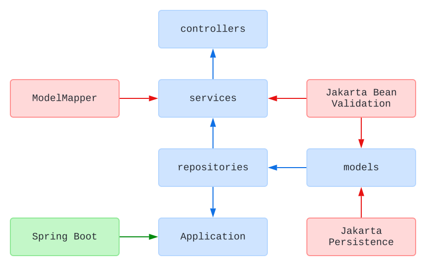

# Sample RESTful Web Service with Spring Boot

## Status

## Manifesto

> "Nobody should start to undertake a large project. You start with a small _trivial_ project, and you should never expect it to get large. If you do, you'll just overdesign and generally think it is more important than it likely is at that stage. Or worse, you might be scared away by the sheer size of the work you envision. So start small, and think about the details. Don't think about some big picture and fancy design. If it doesn't solve some fairly immediate need, it's almost certainly over-designed. And don't expect people to jump in and help you. That's not how these things work. You need to get something half-way _useful_ first, and then others will say "hey, that _almost_ works for me", and they'll get involved in the project." — Linus Torvalds

## About

Proof of Concept for a RESTful Web Service made with [Spring Boot 3](https://spring.io/blog/2024/02/22/spring-boot-3-2-3-available-now) targeting [JDK 21](https://openjdk.org/projects/jdk/21/)

## Structure

The following is a simplified dependency diagram of modules and main libraries:

## Credits

The solution has been coded using [Visual Studio Code](https://code.visualstudio.com/) with the [Extension Pack for Java](https://marketplace.visualstudio.com/items?itemName=vscjava.vscode-java-pack)

## Terms

All trademarks, registered trademarks, service marks, product names, company names, or logos mentioned on this repository are the property of their respective owners. All usage of such terms herein is for identification purposes only and constitutes neither an endorsement nor a recommendation of those items. Furthermore, the use of such terms is intended to be for educational and informational purposes only.
