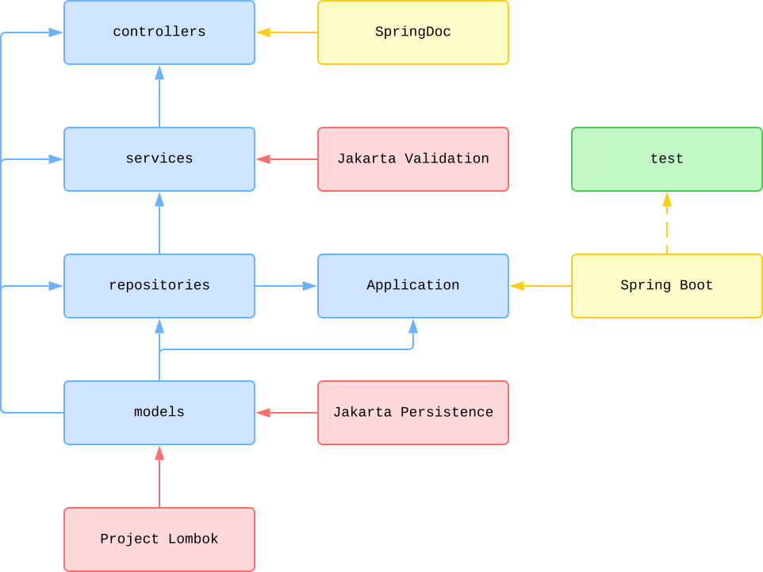
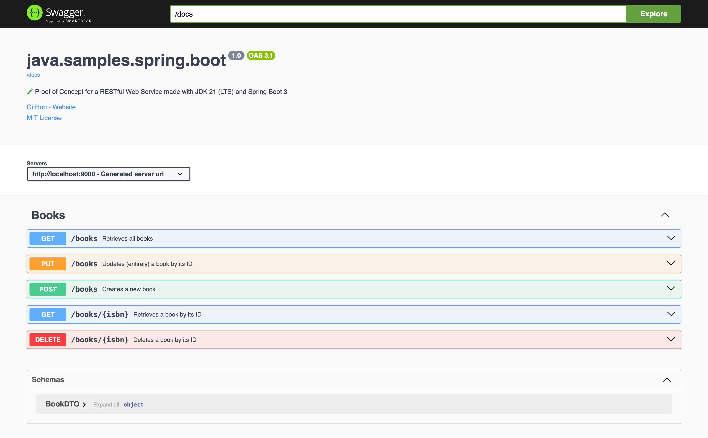

# Sample RESTful Web Service with Spring Boot

## Status

[](https://github.com/nanotaboada/java.samples.spring.boot/actions/workflows/maven.yml)
[](https://sonarcloud.io/summary/new_code?id=nanotaboada_java.samples.spring.boot)
[](https://app.codacy.com/gh/nanotaboada/java.samples.spring.boot/dashboard?utm_source=gh&utm_medium=referral&utm_content=&utm_campaign=Badge_grade)
[](https://codecov.io/gh/nanotaboada/java.samples.spring.boot)
[](https://www.codefactor.io/repository/github/nanotaboada/java.samples.spring.boot)
[](https://codebeat.co/projects/github-com-nanotaboada-java-samples-spring-boot-master)

## About

Proof of Concept for a RESTful Web Service made with [Spring Boot 3](https://spring.io/blog/2024/02/22/spring-boot-3-2-3-available-now) targeting [JDK 21](https://openjdk.org/projects/jdk/21/)

## Structure



_Figure: Simplified, conceptual project structure and main application flow. Not all dependencies are shown._

## Documentation

```console
http://localhost:9000/swagger/index.html
```



## Credits

The solution has been coded using [Visual Studio Code](https://code.visualstudio.com/) with the [Extension Pack for Java](https://marketplace.visualstudio.com/items?itemName=vscjava.vscode-java-pack)

## Terms

All trademarks, registered trademarks, service marks, product names, company names, or logos mentioned on this repository are the property of their respective owners. All usage of such terms herein is for identification purposes only and constitutes neither an endorsement nor a recommendation of those items. Furthermore, the use of such terms is intended to be for educational and informational purposes only.
