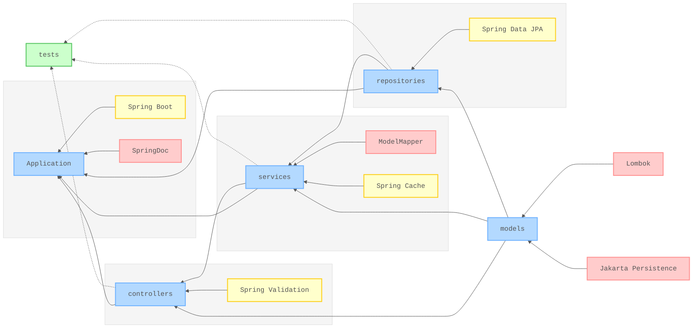

# 🧪 RESTful API with Java and Spring Boot

[](https://github.com/nanotaboada/java.samples.spring.boot/actions/workflows/maven-ci.yml)
[](https://github.com/nanotaboada/java.samples.spring.boot/actions/workflows/codeql.yml)
[](https://sonarcloud.io/summary/new_code?id=nanotaboada_java.samples.spring.boot)
[](https://codecov.io/gh/nanotaboada/java.samples.spring.boot)
[](https://www.codefactor.io/repository/github/nanotaboada/java.samples.spring.boot)
[](https://opensource.org/licenses/MIT)


Proof of Concept for a RESTful Web Service built with **Spring Boot 4** targeting **JDK 25 (LTS)**. This project demonstrates best practices for building a layered, testable, and maintainable API implementing CRUD operations for a Players resource (Argentina 2022 FIFA World Cup squad).

## Features

- 🏗️ **Clean Architecture** - Layered design with clear separation of concerns
- 📚 **Interactive Documentation** - Live API exploration and testing interface
- ✅ **Input Validation** - Bean Validation (JSR-380) constraints
- ⚡ **Performance Caching** - Optimized data retrieval with cache annotations
- 🐳 **Containerized Deployment** - Multi-stage builds with pre-seeded database
- 🔄 **Automated Pipeline** - Continuous integration with automated testing and builds

## Tech Stack

| Component | Technology |
| --------- | ---------- |
| **Framework** | [Spring Boot](https://github.com/spring-projects/spring-boot) 4.0.0 |
| **Runtime** | [Java](https://github.com/openjdk/jdk) (JDK 25 LTS) |
| **Build Tool** | [Maven](https://github.com/apache/maven) |
| **Database (Runtime)** | [SQLite](https://github.com/sqlite/sqlite) |
| **Database (Tests)** | [SQLite](https://github.com/sqlite/sqlite) (in-memory) |
| **ORM** | [Hibernate](https://github.com/hibernate/hibernate-orm) / [Spring Data JPA](https://github.com/spring-projects/spring-data-jpa) |
| **API Documentation** | [SpringDoc OpenAPI](https://github.com/springdoc/springdoc-openapi) |
| **Testing** | [JUnit 5](https://github.com/junit-team/junit5) + [Mockito](https://github.com/mockito/mockito) + [AssertJ](https://github.com/assertj/assertj) |
| **Code Coverage** | [JaCoCo](https://github.com/jacoco/jacoco) |
| **Containerization** | [Docker](https://github.com/docker) + [Docker Compose](https://github.com/docker/compose) |
| **CI/CD** | [GitHub Actions](https://github.com/features/actions) |

> 💡 **Note:** Maven wrapper (`./mvnw`) is included, so Maven installation is optional.

## Architecture

Layered architecture with dependency injection via Spring Boot's IoC container and constructor injection using Lombok's `@RequiredArgsConstructor`.


```mermaid

%%{init: {
  "theme": "default",
  "themeVariables": {
    "fontFamily": "Fira Code, Consolas, monospace",
    "textColor": "#555",
    "lineColor": "#555",
    "clusterBkg": "#f5f5f5",
    "clusterBorder": "#ddd"
  }
}}%%

graph RL

    tests[tests]

    subgraph Layer1[" "]
        Application[Application]
        SpringBoot[Spring Boot]
        SpringDoc[SpringDoc]
    end

    subgraph Layer2[" "]
        controllers[controllers]
        SpringValidation[Spring Validation]
    end

    subgraph Layer3[" "]
        services[services]
        ModelMapper[ModelMapper]
        SpringCache[Spring Cache]
    end

    subgraph Layer4[" "]
        repositories[repositories]
        SpringDataJPA[Spring Data JPA]
    end

    models[models]
    JakartaPersistence[Jakarta Persistence]
    ProjectLombok[Lombok]

    %% Strong dependencies

    %% Layer 1
    SpringBoot --> Application
    SpringDoc --> Application
    controllers --> Application
    services --> Application
    repositories --> Application

    %% Layer 2
    SpringValidation --> controllers
    services --> controllers
    models --> controllers

    %% Layer 3
    SpringCache --> services
    ModelMapper --> services
    repositories --> services
    models --> services

    %% Layer 4
    SpringDataJPA --> repositories
    models --> repositories

    %% Soft dependencies

    controllers -.-> tests
    services -.-> tests
    repositories -.-> tests

    %% Cross-cutting

    JakartaPersistence --> models
    ProjectLombok --> models

    %% Node styling with stroke-width
    classDef core fill:#b3d9ff,stroke:#6db1ff,stroke-width:2px,color:#555,font-family:monospace;
    classDef feat fill:#ffffcc,stroke:#fdce15,stroke-width:2px,color:#555,font-family:monospace;
    classDef deps fill:#ffcccc,stroke:#ff8f8f,stroke-width:2px,color:#555,font-family:monospace;
    classDef test fill:#ccffcc,stroke:#53c45e,stroke-width:2px,color:#555,font-family:monospace;

    class Application,models,repositories,services,controllers core
    class SpringBoot,SpringDataJPA,SpringCache,SpringValidation feat
    class JakartaPersistence,ProjectLombok,ModelMapper,SpringDoc deps
    class tests test
```

> *Arrows follow the injection direction (A → B means A is injected into B). Solid = runtime dependency, dotted = structural. Blue = core domain, red = third-party, green = tests.*

## API Reference

Interactive API documentation is available via Swagger UI at `http://localhost:9000/swagger/index.html` when the server is running.

| Method | Endpoint | Description | Status |
| ------ | -------- | ----------- | ------ |
| `GET` | `/players` | List all players | `200 OK` |
| `GET` | `/players/{id}` | Get player by UUID | `200 OK` |
| `GET` | `/players/search/league/{league}` | Search players by league | `200 OK` |
| `GET` | `/players/squadnumber/{squadNumber}` | Get player by squad number | `200 OK` |
| `POST` | `/players` | Create new player | `201 Created` |
| `PUT` | `/players/{squadNumber}` | Update player by squad number | `204 No Content` |
| `DELETE` | `/players/{squadNumber}` | Remove player by squad number | `204 No Content` |
| `GET` | `/actuator/health` | Health check | `200 OK` |

Error codes: `400 Bad Request` (validation failed) · `404 Not Found` (player not found) · `409 Conflict` (duplicate squad number on `POST`)

For complete endpoint documentation with request/response schemas, explore the [interactive Swagger UI](http://localhost:9000/swagger/index.html). You can also access the OpenAPI JSON specification at `http://localhost:9000/docs`.

## Prerequisites

Before you begin, ensure you have the following installed:

- **Java Development Kit (JDK) 25**
- **Maven 3.9+** (optional) - Project includes Maven wrapper (`./mvnw`)
- **Docker** (optional) - For containerized deployment

> 💡 **Note:** macOS users may need to set `JAVA_HOME`:
>
> ```bash
> export JAVA_HOME=$(/usr/libexec/java_home -v 25)
> ```

## Quick Start

### Clone

```bash
git clone https://github.com/nanotaboada/java.samples.spring.boot.git
cd java.samples.spring.boot
```

### Build

```bash
./mvnw clean package
```

### Run

```bash
./mvnw spring-boot:run
```

### Access

Once the application is running, you can access:

- **API Server**: `http://localhost:9000`
- **Swagger UI**: `http://localhost:9000/swagger/index.html`
- **OpenAPI Spec**: `http://localhost:9000/docs`
- **Health Check**: `http://localhost:9001/actuator/health`

## Containers

### Build and Start

```bash
docker compose up
# or detached mode
docker compose up -d
```

**Exposed Ports:**

- `9000` - Main API server
- `9001` - Actuator management endpoints

> 💡 **Note:** The Docker container uses a pre-seeded SQLite database with Argentina 2022 FIFA World Cup squad data. On first run, the database is copied from the image to a named volume (`java-samples-spring-boot_storage`) ensuring data persistence across container restarts.

### Stop

```bash
docker compose down
```

### Reset Database

To reset the database to its initial state:

```bash
docker compose down -v  # Remove volumes
docker compose up       # Fresh start with seed data
```

### Pull Docker images

Each release publishes multiple tags for flexibility:

```bash
# By semantic version (recommended for production)
docker pull ghcr.io/nanotaboada/java-samples-spring-boot:1.0.0

# By club name (memorable alternative)
docker pull ghcr.io/nanotaboada/java-samples-spring-boot:arsenal

# Latest release
docker pull ghcr.io/nanotaboada/java-samples-spring-boot:latest
```

## Environment Variables

### Development

Configured in `src/main/resources/application.properties`:

```properties
server.port=9000
management.server.port=9001
spring.datasource.url=jdbc:sqlite:storage/players-sqlite3.db
springdoc.swagger-ui.path=/swagger/index.html
springdoc.api-docs.path=/docs
```

### Testing

Configured in `src/test/resources/application.properties`:

```properties
spring.datasource.url=jdbc:sqlite::memory:
spring.jpa.hibernate.ddl-auto=create-drop
```

## Database Migrations

Schema versioning is managed by [Flyway](https://documentation.red-gate.com/flyway), which runs automatically on application startup and applies any pending migrations in order.

### Migration files

Versioned SQL scripts live in `src/main/resources/db/migration/` and follow the Flyway naming convention:

```text
V{version}__{description}.sql
```

| File | Description |
| ---- | ----------- |
| `V1__Create_players_table.sql` | Creates the `players` table (schema) |
| `V2__Seed_starting11.sql` | Seeds 11 Starting XI players (`starting11 = 1`) |
| `V3__Seed_substitutes.sql` | Seeds 15 Substitute players (`starting11 = 0`) |

All migration SQL is written to be compatible with both **SQLite** (local dev) and **PostgreSQL** (see #286).

### First start

On first run, Flyway detects an empty database and applies V1 → V2 → V3 in sequence, creating the `players` table and seeding all 26 players. The database file (`storage/players-sqlite3.db`) is created automatically and is excluded from version control.

### Adding a new migration

Create a new file in `src/main/resources/db/migration/` with the next version number:

```bash
touch src/main/resources/db/migration/V4__Add_nationality_column.sql
```

Flyway applies it automatically on the next application startup. View the applied history by querying the `flyway_schema_history` table.

### Reset local database

Delete the SQLite file and restart — Flyway recreates the schema and seed data from scratch:

```bash
rm storage/players-sqlite3.db
./mvnw spring-boot:run
```

### Tests

The test environment keeps `spring.flyway.enabled=false` and uses SQLite in-memory with `ddl.sql`/`dml.sql` via Spring SQL init for fast, isolated test execution.

## Contributing

Contributions are welcome! Please see [CONTRIBUTING.md](CONTRIBUTING.md) for details on:

- Code of Conduct
- Development workflow and best practices
- Commit message conventions (Conventional Commits)
- Pull request process and requirements

**Key guidelines:**

- Follow [Conventional Commits](https://www.conventionalcommits.org/) for commit messages
- Ensure all tests pass (`./mvnw verify`)
- Always use Maven wrapper (`./mvnw`), never system Maven
- Keep changes small and focused
- Review `.github/copilot-instructions.md` for architectural patterns

**Testing:**

Run the test suite with JUnit 5 + JaCoCo:

```bash
# Run tests with coverage report
./mvnw verify

# View coverage report
open target/site/jacoco/index.html
```

## Command Summary

| Command | Description |
| ------- | ----------- |
| `./mvnw clean compile` | Clean and compile the project |
| `./mvnw test` | Run tests without coverage |
| `./mvnw verify` | Run tests with JaCoCo coverage |
| `./mvnw package` | Build JAR file |
| `./mvnw spring-boot:run` | Run application locally |
| `./mvnw package -DskipTests` | Build without running tests |
| `docker compose build` | Build Docker image |
| `docker compose up` | Start application container |
| `docker compose up -d` | Start in detached mode |
| `docker compose down` | Stop and remove containers |
| `docker compose down -v` | Stop and remove containers with volumes |
| `docker compose logs -f` | View container logs |
| **AI Commands** | |
| `/pre-commit` | Runs linting, tests, and quality checks before committing |
| `/pre-release` | Runs pre-release validation workflow |

> 💡 **Note:** Always use the Maven wrapper (`./mvnw`) instead of system Maven to ensure consistent builds.

## Legal

This project is provided for educational and demonstration purposes and may be used in production at your own discretion. All trademarks, service marks, product names, company names, and logos referenced herein are the property of their respective owners and are used solely for identification or illustrative purposes.
