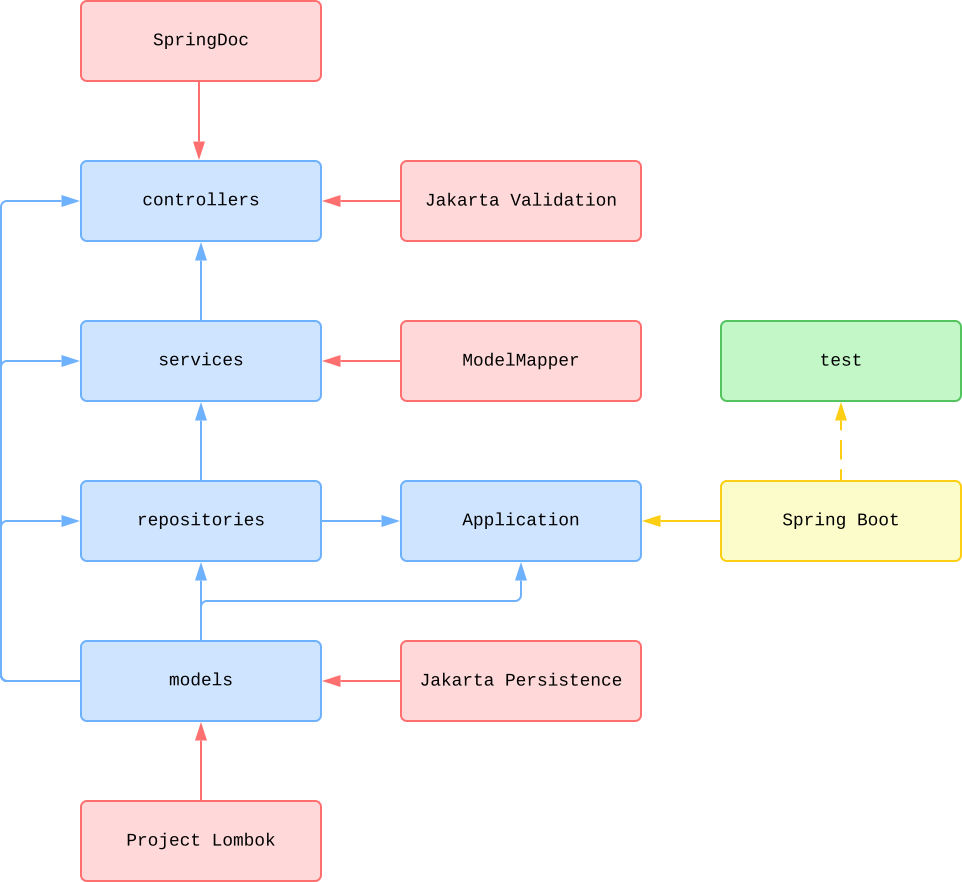

# 🧪 RESTful API with Java and Spring Boot

[](https://github.com/nanotaboada/java.samples.spring.boot/actions/workflows/maven.yml)
[](https://sonarcloud.io/summary/new_code?id=nanotaboada_java.samples.spring.boot)
[](https://app.codacy.com/gh/nanotaboada/java.samples.spring.boot/dashboard?utm_source=gh&utm_medium=referral&utm_content=&utm_campaign=Badge_grade)
[](https://codecov.io/gh/nanotaboada/java.samples.spring.boot)
[](https://www.codefactor.io/repository/github/nanotaboada/java.samples.spring.boot)
[](https://opensource.org/licenses/MIT)

> A production-ready RESTful Web Service demonstrating clean architecture patterns with Spring Boot 4, comprehensive testing, and containerized deployment.

## Table of Contents

- [About](#about)
- [Features](#features)
- [Architecture](#architecture)
- [Prerequisites](#prerequisites)
- [Getting Started](#getting-started)
  - [Local Development](#local-development)
  - [Docker Deployment](#docker-deployment)
- [API Reference](#api-reference)
- [Testing](#testing)
- [Documentation](#documentation)
- [Contributing](#contributing)
- [License](#license)

## About

A proof-of-concept RESTful Web Service built with **Spring Boot 4** targeting **JDK 25 (LTS)**. This project demonstrates best practices for building a layered, testable, and maintainable API implementing CRUD operations for a Books resource.

The service showcases:

- Multi-layer architecture (Controllers → Services → Repositories)
- SQLite database with JPA/Hibernate (H2 for tests)
- Spring Cache abstraction for performance optimization
- Comprehensive test coverage with JUnit 5, Mockito, and AssertJ
- OpenAPI 3.0 documentation with Swagger UI
- Production-ready monitoring with Spring Boot Actuator
- Containerized deployment with Docker and persistent storage

## Features

- ✅ **RESTful API** - Full CRUD operations for Books resource
- ✅ **Clean Architecture** - Layered design with clear separation of concerns
- ✅ **Validation** - Jakarta Bean Validation with custom constraints (ISBN, URL)
- ✅ **Caching** - Spring Cache with `@Cacheable`, `@CachePut`, `@CacheEvict`
- ✅ **API Documentation** - Interactive Swagger UI powered by SpringDoc OpenAPI
- ✅ **Health Monitoring** - Spring Boot Actuator endpoints
- ✅ **Test Coverage** - JaCoCo reports with Codecov/Codacy integration
- ✅ **Docker Support** - Multi-stage builds with pre-seeded SQLite database
- ✅ **CI/CD Ready** - GitHub Actions with automated testing and container builds

## Architecture



_Figure: Simplified, conceptual project structure and main application flow. Not all dependencies are shown._

**Layer Responsibilities:**

- **Controller** (Green) - HTTP request handling, DTO validation, OpenAPI annotations
- **Service** (Yellow) - Business logic, caching, Entity-DTO mapping
- **Repository** (Red) - Data access via Spring Data JPA

## Prerequisites

Before you begin, ensure you have the following installed:

- **Java Development Kit (JDK) 25** - [Download](https://adoptium.net/temurin/releases/?version=25)
  - Verify with: `java -version`
- **Maven 3.9+** (optional) - Project includes Maven wrapper (`./mvnw`)
- **Docker** (optional) - For containerized deployment

**macOS Users**: Set `JAVA_HOME` if needed:

```bash
export JAVA_HOME=$(/usr/libexec/java_home -v 25)
```

## Getting Started

### Local Development

1. **Clone the repository**

   ```bash
   git clone https://github.com/nanotaboada/java.samples.spring.boot.git
   cd java.samples.spring.boot
   ```

2. **Build the project**

   ```bash
   ./mvnw clean package
   ```

3. **Run the application**

   ```bash
   ./mvnw spring-boot:run
   ```

4. **Verify it's running**
   - API Server: `http://localhost:9000`
   - Health Check: `http://localhost:9001/actuator/health`
   - Swagger UI: `http://localhost:9000/swagger/index.html`

### Docker Deployment

**Quick Start:**

```bash
docker compose up
```

**Detached Mode:**

```bash
docker compose up -d
```

**Stop Containers:**

```bash
docker compose down
```

**Exposed Ports:**

- `9000` - Main API server
- `9001` - Actuator management endpoints

**Persistent Storage:**

The Docker container uses a pre-seeded SQLite database with sample book data. On first run, the database is copied from the image to a named volume (`java-samples-spring-boot_storage`) ensuring data persistence across container restarts.

To reset the database to its initial state:

```bash
docker compose down -v  # Remove volumes
docker compose up       # Fresh start with seed data
```

## API Reference

The Books API provides standard CRUD operations:

| Method | Endpoint | Description | Request Body | Response |
|--------|----------|-------------|--------------|----------|
| `GET` | `/books` | Retrieve all books | - | `200 OK` with `BookDTO[]` |
| `GET` | `/books/{isbn}` | Retrieve book by ISBN | - | `200 OK` with `BookDTO` or `404 Not Found` |
| `POST` | `/books` | Create a new book | `BookDTO` | `201 Created` with `BookDTO` |
| `PUT` | `/books/{isbn}` | Update existing book | `BookDTO` | `200 OK` with `BookDTO` or `404 Not Found` |
| `DELETE` | `/books/{isbn}` | Delete book by ISBN | - | `204 No Content` or `404 Not Found` |

**BookDTO Schema:**

```json
{
  "isbn": "978-0-596-52068-7",
  "title": "RESTful Web Services",
  "author": "Leonard Richardson, Sam Ruby",
  "published": "2007-05-08",
  "publisher": "O'Reilly Media",
  "pages": 448,
  "description": "An in-depth guide to building web services...",
  "website": "https://example.com"
}
```

For complete API documentation with request/response examples, visit the **Swagger UI** at:

`http://localhost:9000/swagger/index.html`


## Testing

Run the full test suite with coverage:

```bash
./mvnw verify
```

**View Coverage Report:**

```bash
open target/site/jacoco/index.html
```

**Test Structure:**

- **Unit Tests** - `@WebMvcTest`, `@DataJpaTest` for isolated layer testing (with `@AutoConfigureCache` for caching support)
- **Test Database** - H2 in-memory database for fast, isolated test execution
- **Mocking** - Mockito with `@MockitoBean` for dependency mocking
- **Assertions** - AssertJ fluent assertions
- **Naming Convention** - BDD style: `given<Condition>_when<Action>_then<Expected>`

**Coverage Targets:**

- Controllers: 100%
- Services: 100%
- Repositories: Custom query methods (interfaces excluded by JaCoCo design)

**SQLite Configuration Notes:**

- Dates are stored as Unix timestamps (INTEGER) for robustness - no date format parsing issues
- A JPA `AttributeConverter` handles LocalDate ↔ epoch seconds conversion transparently
- Use `ddl-auto=none` since the database is pre-seeded (SQLite has limited ALTER TABLE support)
- Tests use H2 in-memory database - the converter works seamlessly with both databases

## Documentation

- **API Documentation**: Swagger UI at `http://localhost:9000/swagger/index.html`
- **OpenAPI Spec**: Available at `http://localhost:9000/v3/api-docs`
- **Actuator Endpoints**: `http://localhost:9001/actuator`
- **Agent Onboarding**: See `.github/copilot-instructions.md` for development guidelines

## Contributing

Contributions are welcome! Please see [CONTRIBUTING.md](CONTRIBUTING.md) for:

- Code of Conduct
- Development workflow
- Commit message conventions
- Pull request process

## License

This project is licensed under the MIT License - see the [LICENSE](LICENSE) file for details.

## Acknowledgments

This solution has been developed using [Visual Studio Code](https://code.visualstudio.com/).

All trademarks, registered trademarks, service marks, product names, company names, or logos mentioned on this repository are the property of their respective owners. All usage of such terms herein is for identification purposes only and constitutes neither an endorsement nor a recommendation of those items. Furthermore, the use of such terms is intended to be for educational and informational purposes only.
